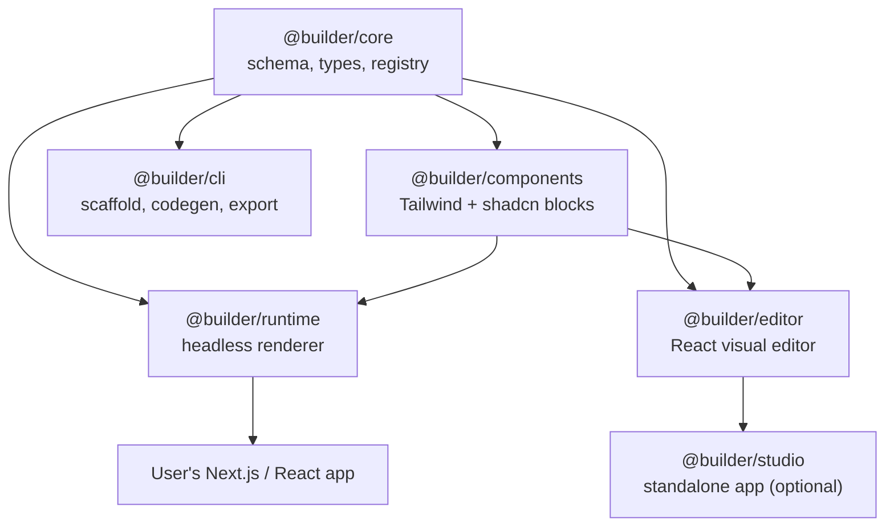

# Modern Fork of VvvebJs — React + Tailwind + shadcn Page Builder

> [Notion source](https://app.notion.com/p/38c4fd00932a49a6978c944924579c54)

## The idea

Fork the VvvebJs drag-and-drop page builder and rebuild it as a *modern, React-native* visual editor + runtime. Swap Bootstrap/vanilla-JS/plain-HTML for **Tailwind + shadcn/ui**, ship it as an **importable React library** (not a standalone app), and make the **runtime extensible** so users register their own interactive React components without ever modifying the core renderer. Crucially, make it **agent-first**: an AI that designs *beautiful* pages by authoring JSX + Tailwind into an editable tree — not by rearranging stock blocks. Publish as open source.

## Why fork VvvebJs

VvvebJs is a genuinely great editing *experience* — true WYSIWYG, edit any element, drop anything anywhere, live HTML/CSS editing. But its foundations are dated for a modern React stack.

| What's worth keeping | What's outdated / to replace |
| --- | --- |
| True WYSIWYG — edited page == final result | Vanilla JS DOM manipulation inside an iframe |
| Unlimited placement (any element, anywhere) | Bootstrap 5 as the styling primitive |
| Components / Blocks / Sections concept | Output is a static HTML string — no real interactivity |
| No-code experience + code editing escape hatch | Standalone tool, hard to embed in a React app |
| Apache-2.0 license → free to fork & relicense-compatible | Adding components means editing builder internals |

> VvvebJs (and the Vvveb CMS) are **Apache-2.0 licensed**, so forking and publishing your own open-source version is fully allowed. You must retain the original copyright/license notices and the NOTICE file, and clearly state your changes. Practically, a clean React rewrite that *borrows the UX* but not the code carries even less legal baggage — decide early how much original code you actually keep.

## Product principles

1. **Library-first, not app-first.** Everything ships as `npm` packages you drop into an existing React/Next.js app. The "studio" is just one consumer of the core.
2. **One artifact, two projections.** The source of truth is an editable node tree that is *isomorphic to JSX*: the AI writes JSX/Tailwind, it lowers into the tree, and the tree codegens back to clean React. Code is both an input and an export target.
3. **Registry-driven runtime.** The renderer knows nothing about specific components. You register components into a config; the runtime stays untouched as the library grows.
4. **Real components, real interactivity.** Dropped components are actual React components with their own state/hooks/effects — so interactivity works at runtime by construction.
5. **Tailwind + shadcn as the design system.** Styling is utility classes + composable primitives, editable visually but exportable as clean code.
6. **Agent-first & beautiful by default.** The AI is a first-class co-editor that designs from primitives + full Tailwind freedom (raw-React aesthetic ceiling), steered by design tokens, curated examples, and a render→screenshot→vision-critique loop.

## Target architecture

A monorepo (pnpm workspaces + Turborepo) split into focused packages so consumers install only what they need.



| Package | Responsibility | Depends on |
| --- | --- | --- |
| `@builder/core` | Document schema, TypeScript types, component-config (`defineComponent`), the registry/config builder, field/control definitions | — |
| `@builder/runtime` | Headless `<Render/>` that walks the JSON tree and renders registered components. Zero editor code → tiny bundle for production sites. | core |
| `@builder/editor` | The visual canvas: drag-drop, selection, props panel, layers/navigator, undo/redo, viewport breakpoints. Embeddable as `<Editor/>`. | core |
| `@builder/components` | Default block library built on Tailwind + shadcn (Hero, Features, Nav, Pricing, Form, etc.) — fully optional/replaceable. | core |
| `@builder/studio` | Optional standalone Next.js app (auth, page list, persistence) for people who want the full CMS experience. | editor, runtime |
| `@builder/cli` | Scaffold projects, register components, export a page to static HTML/MDX/React. | core |

## The data model

The source of truth is a JSON document: a tree of `{ type, props, children }`. `type` is a string key into the registry; `props` are the editable values; layout/styling lives in props (Tailwind classes + structured style tokens).

```json
{
  "root": { "props": { "title": "Landing page" } },
  "content": [
    {
      "type": "Hero",
      "props": {
        "id": "hero-1",
        "title": "Build sites visually",
        "subtitle": "Tailwind + shadcn, no lock-in",
        "className": "py-24 bg-background"
      }
    },
    {
      "type": "Features",
      "props": { "id": "feat-1", "columns": 3 },
      "children": [
        { "type": "FeatureCard", "props": { "id": "fc-1", "title": "Fast" } }
      ]
    }
  ]
}
```

## Component registry & dynamic interactivity

Each component is declared once with (a) its real React render function and (b) editor metadata describing which props are editable and with what controls. Everything gets collected into a single `config`.

```typescript
// my-hero.tsx
import { defineComponent } from "@builder/core"
import { Button } from "@/components/ui/button" // shadcn

export const Hero = defineComponent({
  name: "Hero",
  fields: {
    title: { type: "text" },
    subtitle: { type: "textarea" },
    ctaLabel: { type: "text" },
    className: { type: "tailwind" },
  },
  defaultProps: { title: "Build faster", subtitle: "…", ctaLabel: "Get started" },
  render: ({ title, subtitle, ctaLabel, className }) => (
    <section className={cn("flex flex-col items-center gap-4", className)}>
      <h1 className="text-5xl font-bold tracking-tight">{title}</h1>
      <p className="text-muted-foreground">{subtitle}</p>
      <Button>{ctaLabel}</Button>
    </section>
  ),
})
```

```typescript
// builder.config.ts — the registry
import { createConfig } from "@builder/core"
import { Hero } from "./my-hero"
import { Features, FeatureCard } from "./features"

export const config = createConfig({
  components: { Hero, Features, FeatureCard },
})
```

```typescript
// production page — runtime never changes when you add components
import { Render } from "@builder/runtime"
import { config } from "./builder.config"

export default function Page({ data }) {
  return <Render config={config} data={data} />
}
```

> **Why interactivity "just works":** because dropped blocks are real React components, a component can use `useState`, data fetching, animations, etc. The runtime only does a generic registry lookup + recursive render. Registering a new interactive component requires **zero** changes to `@builder/runtime` — the registry is the only extension point.

## Styling: Tailwind + shadcn strategy

- **shadcn/ui** primitives are *copied into the consumer's repo* — the builder must treat shadcn components as an injectable dependency rather than bundling them.
- **Tailwind** classes are stored as props. Provide visual controls that *write Tailwind classes*, plus a raw class escape hatch.
- **Theming via CSS variables** (shadcn tokens: `--background`, `--primary`, …) so the editor's theme switching maps cleanly to design tokens.
- Ship a **Tailwind preset** so generated class names are safelisted and don't get purged at export time.

## The editor

Rebuild Vvveb's UX in React. Strong open-source prior art:

- **Puck** (`measuredco/puck`) — closest match: React, registry-driven, JSON output.
- **Craft.js** — low-level framework for building drag-drop React editors with a node tree.
- **GrapesJS** — mature editor internals (still framework-agnostic/DOM based).
- **Builder.io / Plasmic** — commercial references for the "visual editor over your own components" model.

Editor feature checklist (parity with Vvveb + modern upgrades):

- [ ] Drag-drop from a Components/Blocks/Sections palette into a live canvas
- [ ] Click-to-select any node; contextual props panel (driven by `fields`)
- [ ] Layers/Navigator tree (body → section → element)
- [ ] Responsive viewport switcher (mobile / tablet / laptop / desktop)
- [ ] Undo/redo, copy/paste, duplicate, keyboard shortcuts
- [ ] Inline rich-text editing for text nodes
- [ ] Tailwind class control + raw code escape hatch
- [ ] Save/load JSON document (pluggable persistence)
- [ ] Iframe-isolated canvas so the site's CSS doesn't fight the editor chrome

## Tech stack

| Concern | Choice |
| --- | --- |
| Language | TypeScript (strict) |
| UI | React 18+ (RSC-aware runtime) |
| Styling | Tailwind CSS + shadcn/ui primitives |
| Drag & drop | dnd-kit (modern, accessible) |
| State | Zustand or Immer-based store for the document tree |
| Monorepo | pnpm workspaces + Turborepo |
| Bundling | tsup / Vite library mode |
| Docs site | Next.js + the builder dogfooding itself |
| Testing | Vitest + Playwright (editor e2e) |

## Implementation roadmap

> **Build as parallel subagents.** See [parallel-subagent-orchestration.md](./parallel-subagent-orchestration.md) for the dependency DAG, wave schedule, and per-agent task briefs.

### Phase 0 — Foundations

- [ ] Decide: clean rewrite vs. keep VvvebJs code
- [ ] Set up monorepo, TS config, lint/format, CI, changesets for releases
- [ ] Lock package boundaries (core / runtime / editor / components)

### Phase 1 — Core + Runtime (MVP of the engine)

- [ ] Define document schema + TS types
- [ ] Implement `defineComponent` + `createConfig` registry
- [ ] Build headless `<Render>` (recursive, registry lookup, children slots)
- [ ] Prove dynamic interactivity with a stateful demo component

### Phase 2 — Editor (visual layer)

- [ ] Canvas with dnd-kit + iframe isolation
- [ ] Selection + props panel generated from `fields`
- [ ] Layers/navigator, undo/redo, responsive viewports
- [ ] Tailwind class controls + raw-class escape hatch

### Phase 3 — Component library on Tailwind + shadcn

- [ ] shadcn adapter (point builder at user's `@/components/ui`)
- [ ] Ship default blocks: Hero, Features, Nav, Footer, Pricing, FAQ, CTA, Form
- [ ] Theme/token editing via CSS variables

### Phase 4 — Persistence, export & studio

- [ ] Pluggable storage interface (file / DB / API)
- [ ] Export to static HTML + to React/MDX source
- [ ] Optional `@builder/studio` app (page list, auth, multi-page)

### Phase 5 — Open-source launch

- [ ] Docs site (getting started, recipes, API reference)
- [ ] Starter templates + CodeSandbox/StackBlitz demos
- [ ] License, NOTICE, CONTRIBUTING, CoC, issue/PR templates
- [ ] Publish to npm under a scope; tag `v0.1.0`; announce

## Open-source release plan

- **License:** keep **Apache-2.0** (matches VvvebJs origin, patent grant, business-friendly). Or MIT if you don't keep original code.
- **Attribution:** preserve VvvebJs copyright + NOTICE; add a "Credits / Inspired by" section.
- **Naming:** pick a distinct name (avoid "Vvveb" in the package/brand). Reserve the npm scope + GitHub org early.
- **Governance:** semantic-release via changesets, clear `main`-branch protection, public roadmap.

## Risks & open questions

- [ ] **Keep vs. rewrite:** reusing VvvebJs's vanilla-JS internals fights the React model; a rewrite is cleaner but more work. (Recommend: rewrite, borrow UX.)
- [ ] **shadcn distribution model:** components are copied into user repos, not installed — the builder must adapt to a user-owned UI folder.
- [ ] **RSC / server components:** decide which blocks are client vs. server; the runtime should support both.
- [ ] **Tailwind purging on export:** generated/dynamic classes must be safelisted.
- [ ] **Editor ⊂ iframe vs. shadow DOM** for style isolation — prototype both.
- [ ] **Free-form placement vs. structured slots:** Vvveb allows anything anywhere; a typed component tree is safer but less freeform. Find the balance.

## Prior art to study

- VvvebJs — `github.com/givanz/VvvebJs`
- Puck — `github.com/measuredco/puck`
- Craft.js — `github.com/prevwong/craft.js`
- GrapesJS — `github.com/GrapesJS/grapesjs`
- Plasmic / Builder.io (commercial references)

## Child specs

See [README.md](./README.md) for the full index of detailed specification documents.
