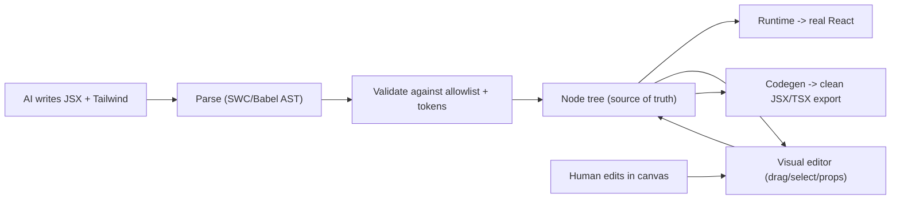
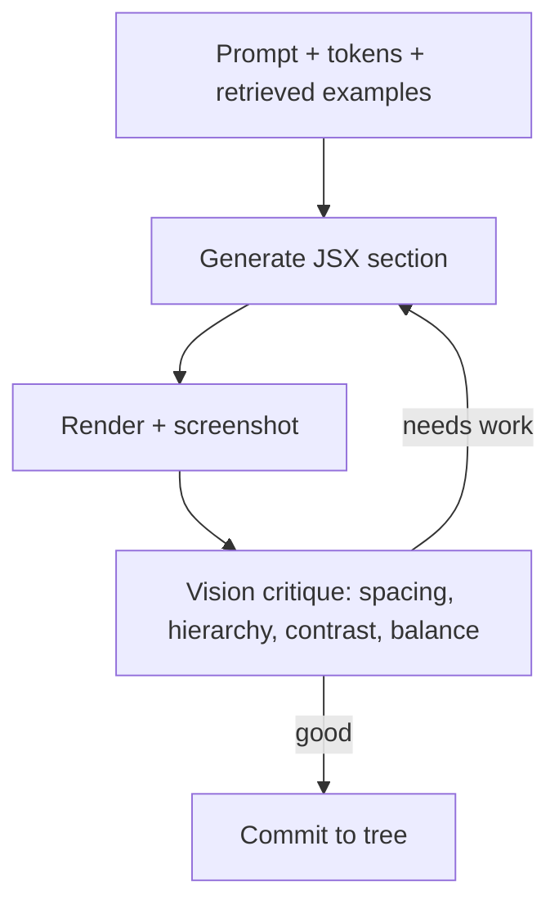

# Agent-First Architecture & AI Design Quality

> [Notion source](https://app.notion.com/p/0e15bf5a5177423facbb8f9d2cfaa310)

## The core bet

An *agent-first* page builder where the AI authors in its strongest medium — **JSX + Tailwind** — yet still produces a structured, editable, interactive tree. This fixes Puck's deal-breaker: AI-generated pages look as good as hand-written React, not like rearranged stock blocks.

## Why Puck's AI output looks generic (diagnosis)

The limitation is **not** "JSON." JSON is just a serialization. The real ceiling is the **granularity of the registry**:

- Puck's AI emits a tree of *high-level blocks* (`Hero`, `Features`) with a *fixed, small set of props*.
- So the AI is **rearranging pre-designed blocks**, not *designing*. The aesthetic ceiling = whatever your block library already looks like.
- Raw HTML/React feels better because the AI controls **every element, class, spacing, and composition** — unbounded design space.

> **Key reframe:** Give the AI the *same expressive power as JSX* inside a structured tree. The tree's nodes should be **HTML primitives with arbitrary Tailwind classes** (unbounded design) **plus registered smart components** (interactivity). Then "JSON vs code" stops mattering — because the tree is isomorphic to JSX.

## The unlock: a tree that is isomorphic to JSX

If your node schema can losslessly represent any (allowlisted) JSX, then **code ⇄ tree is a reversible transform**:

- AI generates **JSX + Tailwind** → parse to AST → lower into the node tree.
- Visual editor edits the **tree**.
- "View code" / export = **codegen the tree back to clean JSX**.
- The runtime renders the tree as real React.

The AI works in code (where it's beautiful); the system stores a tree (where it's editable/safe). Same artifact, two projections.



## Two-tier component model

| Tier | What | Purpose | Who designs it |
| --- | --- | --- | --- |
| **Primitives** | `section, div/Box, Flex, Grid, Text, Heading, Image, Button, Link, Icon` — each accepts arbitrary `className` + children | Unbounded layout & visual design | The AI, freely |
| **Smart components** | Registered React components: `Carousel, Tabs, Accordion, Form, Dialog, Countdown`… (shadcn-based) | Real interactivity & behavior | You / library authors; AI composes them |

The AI builds most of the *look* from primitives (so it can make anything), and drops in smart components when behavior is needed.

## Expressive node schema

```typescript
// An element node can be ANY allowlisted HTML tag or a registered component.
export interface ElementNode {
  id: string
  /** "div" | "section" | "h1" ... (primitive) OR a registry key like "Carousel". */
  tag: string
  /** Arbitrary props. className holds full Tailwind freedom. */
  props: { className?: string; [key: string]: unknown }
  /** Inline text OR child nodes. */
  children?: Array<ElementNode | TextNode>
}
export interface TextNode { id: string; text: string }
```

Because `tag` can be any allowlisted element and `className` is free-form Tailwind, this tree can express **any** layout the AI could write in JSX — while staying structured, diffable, and editable.

## Safety: a constrained JSX dialect, not `dangerouslySetInnerHTML`

Arbitrary AI HTML is an XSS/quality risk. Instead:

- AI emits a **constrained JSX dialect**: allowlisted tags, allowlisted attributes, registered components only.
- Parse with **SWC/Babel** → reject anything off-allowlist (`<script>`, raw event strings, unknown components, `style` injections).
- Render via real React elements built from the validated tree — **never** raw HTML injection.

## Making it actually *beautiful* (not just possible)

Five levers:

1. **Design-token contract.** Feed the model the theme: shadcn CSS variables, a spacing scale, type scale, radius, shadow, container widths.
2. **Constrain to the scale (raise the floor).** Disallow arbitrary values like `text-[13px]`/`mt-[7px]`; force the Tailwind token scale + rhythm.
3. **Curated few-shot corpus (RAG).** Maintain a library of *gorgeous* reference sections. Retrieve the closest examples and put them in context.
4. **Vision self-critique loop.** Render → screenshot (Playwright) → a vision model critiques layout/contrast/spacing/visual hierarchy → AI revises.
5. **shadcn primitives for polish.** Any interactive/standard element uses shadcn so it looks refined by default.



## Agent-first product architecture

The agent is a **first-class actor on the same document the human edits** — not a one-shot generator bolted on.

**Structured edit tools** the agent calls (safe, diffable, undoable, partial):

```typescript
type AgentTool =
  | { name: "generateSection"; args: { intent: string; insertAfter?: string } }
  | { name: "replaceSection"; args: { nodeId: string; intent: string } }
  | { name: "editNode"; args: { nodeId: string; jsx: string } }
  | { name: "setClassName"; args: { nodeId: string; className: string } }
  | { name: "applyTheme"; args: { tokens: Record<string, string> } }
  | { name: "moveNode"; args: { nodeId: string; targetId: string; position: "before" | "after" | "inside" } }
```

- **Co-editing:** the agent mutates the same tree the visual editor renders; agent changes surface as **diffs** the user can accept/reject.
- **Generation = code-first, commit = tree:** the agent writes JSX for a section, the pipeline parses→validates→lowers to tree→inserts.
- **Streaming preview:** stream tokens → progressively render so the user watches it build.
- **Whole-page or section-scoped:** the same loop runs for "design my landing page" or "make this CTA bolder."

```
loop:
  context = systemPrompt(tokens, componentRegistry) + retrievedExamples + currentTreeSummary
  jsx     = LLM.generate(context, userIntent)
  ast     = parse(jsx); validate(ast)
  subtree = lower(ast)
  shot    = renderAndScreenshot(applyPreview(subtree))
  verdict = visionCritique(shot)
  if verdict.good: commit(subtree); break
  else: userIntent += verdict.feedback
```

## How this changes Build vs Adopt

> Puck's own AI emits **registry-JSON** — the exact ceiling you're rejecting. So the **schema + code-first AI pipeline + design-quality loop is your real differentiation and must be yours.** You can still *reuse* Puck (or Craft.js) for the **visual editor / drag-drop / iframe viewports**, as long as its node model can hold your expressive primitive tree. If it can't represent free-form primitive + className trees cleanly, lean toward **building the engine on Craft.js**.

## Acceptance criteria for "agent-first + beautiful"

- [ ] AI generates a full landing page section that is **visually indistinguishable** from hand-written React/Tailwind (blind A/B test).
- [ ] Generated output is a valid tree that is **fully editable** in the visual editor (select, restyle, move).
- [ ] Round-trip: AI JSX → tree → codegen JSX renders identically (lossless).
- [ ] Validation blocks `<script>`/unknown components/off-token values 100% of the time.
- [ ] Vision-critique loop measurably improves a rubric score across iterations.
- [ ] Agent edits apply as reviewable diffs on the shared document.

## New risks / open questions

- [ ] **Tree expressiveness vs editor simplicity:** a JSX-isomorphic tree is powerful but the editor must handle arbitrary nesting gracefully.
- [ ] **Token discipline vs creativity:** too strict = generic; too loose = inconsistent. Tune the allowlist.
- [ ] **Latency/cost of the vision loop:** cache, cap iterations, run critique only on final candidates.
- [ ] **Codegen fidelity:** formatting, key stability, and `"use client"` placement on export.
- [ ] **Engine fit:** confirm whether Puck's data model can hold the primitive tree, or whether Craft.js/own-engine is required.
