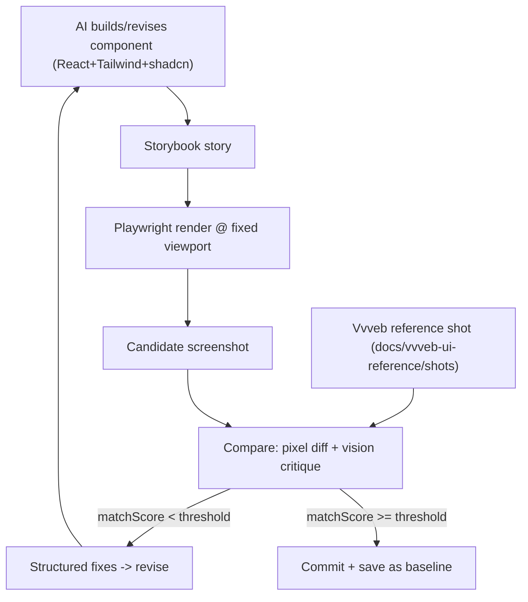

# Screenshot-Diff Matching Loop — Detailed Spec

> [Notion source](https://app.notion.com/p/2b1c54a2853449618f68b0477dd79708)

How you *enforce* Vvveb-level fidelity: render the AI's UI, compare it to the Vvveb reference screenshot, and iterate until it matches. Same machinery as the design-quality loop — but the reference is a **Vvveb screenshot**, and the goal is **match**, not generic taste.

## Architecture



## Two comparison signals (use both)

| Signal | Tool | Gives you | Role |
| --- | --- | --- | --- |
| **Pixel / structural diff** | `pixelmatch` or SSIM | A hard 0–1 similarity score + diff mask image | Objective gate + regression metric |
| **Vision critique** | Vision LLM | *Why* it differs + concrete Tailwind fixes | Actionable revision instructions |

Pixel diff tells you *how far off*; the vision model tells you *what to change*. The loop needs both.

## Step-by-step

1. **Isolate the component** in a Storybook story (so you render the exact region, not the whole app).
2. **Render with Playwright** at the **same viewport size** the Vvveb shot was captured at; wait for fonts/icons (`networkidle`).
3. **Normalize**: same DPR, same background, crop to the same bounding box as the reference.
4. **Pixel diff** candidate vs reference → `matchScore` (e.g. `1 - mismatchedPixels/total`) + a diff-mask PNG highlighting regions.
5. **Vision critique**: send candidate + reference (+ diff mask) to the vision model → structured fixes.
6. **Revise**: feed fixes back; AI edits the component.
7. **Stop** when `matchScore >= THRESHOLD` (e.g. 0.97) or iteration cap (e.g. 5). Keep the **best** score.
8. **Save** the accepted candidate as the **baseline** for CI visual regression.

## Structured diff output

```typescript
interface UiDiff {
  matchScore: number            // 0-1 pixel/structural similarity
  passes: boolean               // matchScore >= threshold
  differences: Array<{
    region: string              // "left panel header", "input row"
    property: "spacing" | "font" | "color" | "size" | "border" | "radius" | "layout" | "icon"
    current: string             // "px-3, text-sm"
    target: string              // "px-4, text-[13px]"
    fix: string                 // "reduce label size to 13px; increase row padding to px-4"
  }>
  summary: string
}
```

## Vision-model prompt (verbatim)

```
You are matching a React UI to a REFERENCE screenshot (VvvebJs). You are shown:
(1) the reference, (2) the current candidate, (3) a diff mask. Identify every
visible difference and return ONLY JSON matching the UiDiff schema.

For each difference give a CONCRETE Tailwind/CSS fix referencing the editor's
tokens (e.g. "panel is 24px too wide -> set w-[240px]", "label too dark ->
text-muted-foreground", "rows too tight -> py-2 not py-1", "missing 1px bottom
border -> border-b border-border"). Ignore differences listed in INTENDED_DELTAS.
Do not comment on page content inside the canvas, only the editor chrome.
```

## Intended deltas (don't chase changes you made on purpose)

You're *modernizing*, not cloning pixel-for-pixel. Maintain an allowlist so the loop won't "fix" deliberate upgrades:

```json
{
  "intendedDeltas": [
    "shadcn rounded-md corners instead of Bootstrap square",
    "new brand accent color for selection outline",
    "lucide icons instead of Vvveb icon set"
  ]
}
```

## Harness & infra

- **Storybook** + `@storybook/test-runner` or Playwright component testing for isolated renders.
- **Golden references** live in `docs/vvveb-ui-reference/shots/`.
- **Baselines** (accepted candidates) live in `tests/visual/__baselines__/` for CI regression (`@playwright/test` `toHaveScreenshot`).
- Run the AI loop **locally during build**; run pixel-only regression in **CI**.

## Cost / latency controls

- Cap iterations (5); early-exit at threshold; keep best.
- Pixel diff is cheap — run it every iteration; call the **vision model only when** `matchScore` stalls or is below a coarse bar.
- Cache candidate shots by component hash.

## Checklist

- [ ] Storybook stories for each editor region
- [ ] Playwright render at the reference viewport, normalized DPR/crop
- [ ] `pixelmatch`/SSIM scoring + diff-mask output
- [ ] Vision critique returns valid `UiDiff` JSON with Tailwind-level fixes
- [ ] `intendedDeltas` allowlist respected
- [ ] Accepted candidates saved as CI visual baselines
- [ ] Iteration cap + best-candidate retention + caching
