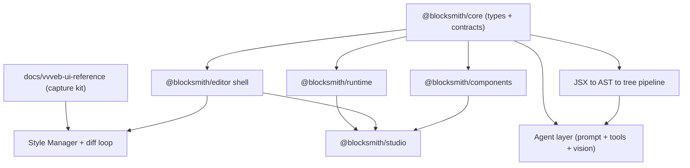

# Parallel Subagent Build Orchestration

> [Notion source](https://app.notion.com/p/69f50bd465ad4778be2cf54bf7dd35d7)

The build is itself **agent-first**: fan the work out across **multiple Cursor background agents running at the same time**, each owning one independent workstream against **frozen interface contracts**.

## The one rule that makes parallelism safe: contracts first

Parallel agents collide when they redefine shared shapes. Avoid it by **freezing the contracts before fanning out**:

- **Type contracts** — the public API of `@blocksmith/core`: `ElementNode`, `TextNode`, `ComponentConfig` / `defineComponent`, the resolver map, and the `AgentTool` union.
- **Doc contracts** — the relevant spec docs (already written) plus a `docs/contracts/` folder for any cross-package detail.
- **Fixture contracts** — a few canonical serialized trees in `packages/core/fixtures/` so every downstream agent can build and test against real data without waiting for real implementations.

Once frozen, changing a contract is a **stop-the-world** event: pause the affected agents, amend the contract, then resume.

## Dependency DAG



The capture kit has **no code dependency** — it can start on day one in parallel with everything else.

## Workstreams (one subagent each)

| Agent | Owns (folder) | Depends on | Starts |
| --- | --- | --- | --- |
| A — Core contracts | `packages/core` | — | Wave 0 |
| B — Capture kit | `docs/vvveb-ui-reference` | — | Wave 0 |
| C — Runtime | `packages/runtime` | core types | Wave 1 |
| D — Pipeline | `packages/core/src/pipeline` | core types | Wave 1 |
| E — Editor shell | `packages/editor` | core types + craft | Wave 1 |
| F — Components | `packages/components` | core defineComponent | Wave 1 |
| G — Style Manager + diff loop | `packages/editor/style` • tooling | editor shell + capture kit | Wave 2 |
| H — Agent layer | `packages/agent` | pipeline + tool contract | Wave 2 |
| I — Studio app | `packages/studio` | editor + runtime + components | Wave 3 |

## Wave schedule

1. **Wave 0 — freeze + scaffold** (blocking, ~1 agent or you). Scaffold from the starter kit, write `@blocksmith/core` types + fixtures, open `docs/contracts/`. Kick off Agent B (capture kit) immediately — it's independent.
2. **Wave 1 — fan out** (4–5 agents in parallel). Runtime, pipeline, editor shell, components — all coding against frozen core types + fixtures.
3. **Wave 2 — parallel** (2–3 agents). Style Manager + diff loop (needs editor shell + capture kit), agent layer (needs pipeline + tool contract), codegen.
4. **Wave 3 — integrate.** Studio app wires packages together; e2e + visual-regression in CI.

## Coordination mechanics

- **Isolation:** one **git branch (or `git worktree`) per agent**; Cursor background agents each work on their own branch and open a PR. Disjoint package folders mean no edit collisions.
- **Dependency ownership:** Agent A owns root deps + the lockfile. Others request additions in their PR; regenerate `pnpm-lock.yaml` at merge to avoid lockfile churn conflicts.
- **Green-gate merges:** every PR must pass `pnpm typecheck && pnpm test` (plus visual diff for UI). Merge **small and often** so branches stay short-lived.
- **Stubs over waiting:** downstream agents import `@blocksmith/core` types + `fixtures/` trees, so they never block on a real implementation.
- **Contract changes:** if an agent needs to change a frozen type, it stops, posts the change, Agent A updates core, dependents pull — never edit a shared contract silently.

## Which spec each agent builds from

- **A — Core / Runtime:** [core-runtime-spec.md](./core-runtime-spec.md)
- **B — Capture kit:** [vvveb-ui-reference/README.md](./vvveb-ui-reference/README.md)
- **D — Pipeline:** [pipeline-spec.md](./pipeline-spec.md)
- **E — Editor shell:** [editor-ui-plan.md](./editor-ui-plan.md)
- **G — Style Manager + diff loop:** [style-manager.md](./style-manager.md) + [diff-loop.md](./diff-loop.md)
- **H — Agent layer:** [agent-first.md](./agent-first.md), [prompt-token.md](./prompt-token.md), [vision-loop.md](./vision-loop.md)

## Per-agent task brief (paste into each background agent)

```markdown
# Agent <X> — <workstream name>

## Scope (only these folders)
packages/<...>          # you may create/edit here
docs/<spec>.md          # READ for the contract

## Contracts you MUST honor (do not change)
- @blocksmith/core types: ElementNode, TextNode, ComponentConfig, resolver
- <other relevant contract>
If a contract is wrong, STOP and report — do not edit it yourself.

## Do not touch
- packages/core/* (owned by Agent A) except adding to fixtures/ via a PR note
- root package.json / pnpm-lock.yaml (owned by Agent A)
- other packages/* outside your scope

## Definition of done
- [ ] Public API matches the spec in docs/<spec>.md
- [ ] `pnpm typecheck` and `pnpm test` pass in your package
- [ ] Unit tests cover the spec's acceptance checklist
- [ ] (UI agents) screenshot-diff matchScore >= 0.97 vs reference
- [ ] PR is small, green, and references docs/<spec>.md

## Reference docs
<links to the relevant specs / docs/*.md>
```

## Launching N agents simultaneously

1. Land Wave 0 on `main` (scaffold + frozen core + fixtures).
2. For each Wave-1 workstream, start a Cursor **background agent** on its own branch, pasting its task brief + the matching spec doc.
3. Let them run concurrently; review PRs as they land; keep `main` green.
4. As Wave-1 contracts land, launch Wave-2 agents the same way.
5. Reserve one "integrator" pass (you or Agent I) to merge, resolve any interface drift, and run e2e.

## Anti-collision checklist

- [ ] Core types + fixtures frozen before Wave 1 starts
- [ ] One branch / worktree per agent; disjoint folder ownership
- [ ] Only Agent A edits root deps + lockfile
- [ ] Every PR green (typecheck + unit + visual diff) before merge
- [ ] Contract changes route through Agent A, never silent
- [ ] Integration pass scheduled after each wave
