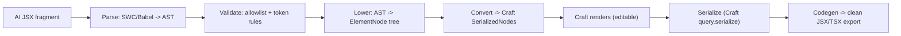

# JSX → AST → Tree Pipeline Spec (Craft.js)

> [Notion source](https://app.notion.com/p/ddf2f891dca2457f92553855e6521f98)

Cursor-ready spec for the reversible transform at the heart of the system: **AI JSX → AST → validated node tree → Craft.js serialized state**, plus the reverse **tree → clean JSX** codegen. Decisions baked in: **JSX-first authoring**, **Craft.js engine**.

## Pipeline overview



## Step 1 — Parse

- Use **`@swc/wasm-web`** (fast, browser-friendly) or **`@babel/parser`** with `{ plugins: ["jsx", "typescript"] }`.
- Wrap the fragment so it parses as an expression: `const __root = (<>{FRAGMENT}</>)`.
- Recommend Babel for MVP (richer ecosystem for traversal via `@babel/traverse`); switch to SWC if perf matters.

## Step 2 — Validate (the safety gate)

Traverse the AST and reject anything off-contract **before** building the tree.

```typescript
const ALLOWED_TAGS = new Set(["section","header","footer","nav","div","span",
  "h1","h2","h3","p","ul","ol","li","a","img","figure","figcaption","blockquote"])
const ALLOWED_ATTRS = new Set(["className","href","src","alt","target","rel",
  "aria-label","role","id","type","placeholder"])

function validate(ast, registry) {
  traverse(ast, {
    JSXElement(path) {
      const name = elementName(path) // "div" or "Button"
      const isComponent = /^[A-Z]/.test(name)
      if (isComponent) {
        if (!registry.has(name)) throw new ValidationError(`Unknown component <${name}>`)
      } else if (!ALLOWED_TAGS.has(name)) {
        throw new ValidationError(`Disallowed tag <${name}>`)
      }
    },
    JSXAttribute(path) {
      const attr = path.node.name.name
      if (attr.startsWith("on")) throw new ValidationError(`Event handler ${attr} not allowed`)
      if (attr === "style") throw new ValidationError(`Inline style not allowed`)
    },
  })
  // className token check: reject arbitrary values like text-[13px]
  for (const cls of allClassNames(ast))
    if (/\[[^\]]+\]/.test(cls)) throw new ValidationError(`Arbitrary value not allowed: ${cls}`)
}
```

Reject: `<script>`, unknown components, `on*` handlers, `style=`, `dangerouslySetInnerHTML`, arbitrary bracket classes. On failure → feed the error back to the agent and retry.

## Step 3 — Lower AST → ElementNode tree

```typescript
import { nanoid } from "nanoid"

function lower(node): ElementNode | TextNode | null {
  if (node.type === "JSXText") {
    const text = node.value.trim()
    return text ? { id: nanoid(6), text } : null
  }
  if (node.type === "JSXExpressionContainer") return lowerExpression(node.expression)
  if (node.type === "JSXElement") {
    return {
      id: nanoid(6),
      tag: elementName(node),
      props: readAttrs(node.openingElement.attributes),
      children: node.children.map(lower).filter(Boolean),
    }
  }
  return null
}
```

- Component props passed as expressions (e.g. `items={[...]}`) are evaluated **statically** (literal arrays/objects only — reject non-serializable expressions) so the tree stays JSON-serializable.

## Step 4 — Convert ElementNode tree → Craft.js serialized nodes

Craft.js stores a flat map of nodes keyed by id, each with `type` (resolved via the **resolver**), `props`, `nodes` (children ids), `parent`, and `linkedNodes`.

```typescript
// Craft resolver: every primitive tag + smart component must be resolvable.
import { Element, useNode } from "@craftjs/core"

export function Prim({ tag = "div", className, children }) {
  const { connectors: { connect, drag } } = useNode()
  const Tag = tag as any
  return <Tag ref={(r) => connect(drag(r))} className={className}>{children}</Tag>
}
Prim.craft = { displayName: "Prim" }

export const resolver = { Prim, Button, Input, Tabs, Accordion, Carousel, Dialog, Icon }
```

```typescript
function toCraft(tree: ElementNode): Record<string, SerializedNode> {
  const out: Record<string, SerializedNode> = {}
  function walk(node: ElementNode, parentId: string | null): string {
    const isComponent = /^[A-Z]/.test(node.tag)
    const id = node.id
    const childIds = (node.children ?? [])
      .filter((c): c is ElementNode => "tag" in c)
      .map((c) => walk(c, id))
    out[id] = {
      type: { resolvedName: isComponent ? node.tag : "Prim" },
      isCanvas: !isComponent,
      props: isComponent ? node.props : { tag: node.tag, ...node.props },
      displayName: node.tag,
      parent: parentId ?? undefined,
      nodes: childIds,
      linkedNodes: {},
      hidden: false,
    }
    return id
  }
  const rootId = walk(tree, null)
  out["ROOT"] = out[rootId]
  return out
}
```

> **Why Craft.js fits:** its node tree is low-level and maps 1:1 to your primitive tree. The `Prim` wrapper lets *any* tag be a draggable, droppable node, so AI-authored arbitrary layouts remain fully editable. Load via `<Frame data={JSON.stringify(craftNodes)} />` and read back with `query.serialize()`.

## Step 5 — Reverse: tree → clean JSX (codegen + export)

```typescript
function codegen(node: ElementNode | TextNode, depth = 0): string {
  const pad = "\t".repeat(depth)
  if ("text" in node) return pad + node.text
  const attrs = Object.entries(node.props)
    .map(([k, v]) => (typeof v === "string" ? `${k}="${v}"` : `${k}={${JSON.stringify(v)}}`))
    .join(" ")
  const open = `${pad}<${node.tag}${attrs ? " " + attrs : ""}>`
  const kids = (node.children ?? []).map((c) => codegen(c, depth + 1)).join("\n")
  return `${open}\n${kids}\n${pad}</${node.tag}>`
}
```

- Run output through **Prettier** for clean formatting.
- For export: hoist smart-component imports, add `"use client"` only if any interactive component is present, wrap in a component function.

## Acceptance checklist

- [ ] Round-trip: `JSX → tree → craft → serialize → codegen → JSX` renders pixel-identical
- [ ] Validation rejects 100% of off-allowlist input; errors are fed back to the agent for retry
- [ ] Non-serializable expressions are rejected (tree stays JSON)
- [ ] AI-authored arbitrary layouts are selectable/movable in the Craft canvas
- [ ] Ids are stable across edits (no churn on re-serialize)
- [ ] Codegen output passes ESLint + Prettier

## Open questions

- [ ] **ROOT handling** — normalize a single top wrapper vs. multiple top-level siblings.
- [ ] **Static evaluation limits** for component props (arrays/objects only; how deep?).
- [ ] **SWC vs Babel** final call (MVP: Babel; revisit for perf/bundle).
- [ ] **Icons** — map `<Icon name="...">` to a tree-shakeable lucide subset.
