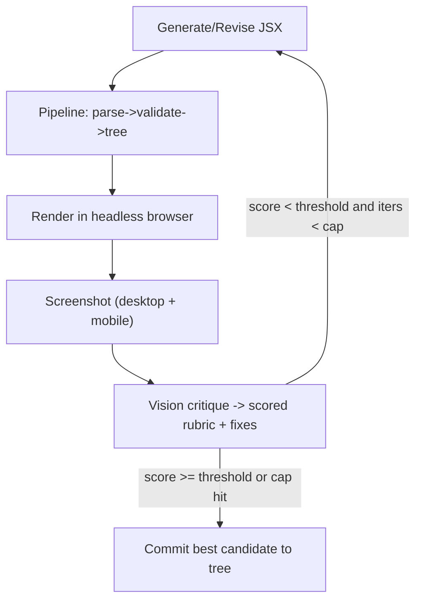

# Vision-Critique Rubric + Loop

> [Notion source](https://app.notion.com/p/afe34ae58d1844cb91c59ab33df5b4c1)

The quality multiplier: **render → screenshot → vision-model critique → revise**. This is what makes AI output reliably *beautiful* rather than merely valid.

## The loop



```
candidate = generate(intent)
best = null
for i in 0..MAX_ITERS (default 3):
  tree  = pipeline(candidate)
  shots = renderAndShoot(tree, [desktop, mobile])
  crit  = visionCritique(shots, intent, rubric)
  if best == null or crit.score > best.score: best = { tree, score: crit.score }
  if crit.score >= THRESHOLD (default 8.5/10): break
  candidate = revise(candidate, crit.feedback, crit.annotatedIssues)
commit(best.tree)
```

## Rendering & screenshot infra

- **Playwright** (headless Chromium) renders the candidate in an isolated route that loads your Tailwind + shadcn theme.
- Capture at **two viewports**: desktop `1280×800` and mobile `390×844` (catch responsive breakage).
- Render on a neutral background; wait for fonts/images (`waitForLoadState("networkidle")`).
- For server/agent runs, a screenshot microservice; for local dev, Playwright directly.

## Critique rubric (0–10 each, weighted)

| Dimension | What the vision model checks | Weight |
| --- | --- | --- |
| Visual hierarchy | Clear focal point; heading/body/CTA emphasis order reads correctly | 20% |
| Spacing & rhythm | Consistent padding/gaps; no cramped or floating elements; balanced whitespace | 20% |
| Alignment & grid | Elements align to a grid; consistent margins; no accidental off-center | 15% |
| Color & contrast | On-token palette; AA contrast; tasteful accent use; dark-mode safe | 15% |
| Typography | Scale used correctly; line-length/leading; no orphan/overflow | 10% |
| Responsiveness | Mobile shot is not broken; reflow is sensible | 10% |
| Polish / "designed" feel | Cohesive, intentional, modern; would pass as hand-crafted | 10% |

## Structured critique output (force JSON)

```typescript
interface Critique {
  scores: {
    hierarchy: number; spacing: number; alignment: number; contrast: number;
    typography: number; responsive: number; polish: number;
  }
  score: number               // weighted 0-10
  passes: boolean             // score >= threshold
  issues: Array<{
    severity: "low" | "med" | "high"
    region: string            // "hero heading", "mobile CTA"
    problem: string           // "heading competes with subhead; bump size/weight"
    fix: string               // concrete Tailwind-level instruction
  }>
  summary: string
}
```

## Vision-model prompt (verbatim)

```
You are a meticulous senior design critic. You are shown desktop and mobile
screenshots of a web section and the user's intent. Score each rubric dimension
0-10 and return ONLY JSON matching the Critique schema.

Be specific and actionable: name the exact region and give a concrete,
Tailwind-level fix (e.g. "increase section padding to py-24", "make h1 text-5xl
font-bold and reduce subhead to text-lg text-muted-foreground", "add gap-8
between cards", "CTA lacks contrast — use bg-primary text-primary-foreground").
Penalize: cramped spacing, weak hierarchy, misalignment, low contrast,
inconsistent rhythm, broken mobile layout, generic/templated feel.
Reward: clear focal point, confident whitespace, cohesive tokenized palette.
```

## Feeding fixes back

- Pass `issues[]` (sorted high→low severity) into the **revise** turn as explicit edit instructions, plus the prior JSX.
- Keep edits **surgical** (re-author only the flagged regions when possible) to avoid regressing good parts.
- Track score per iteration; **keep the best**, not necessarily the last.

## Cost & latency controls

- **Cap iterations** (default 3); early-exit at threshold.
- Run the vision loop only on **section/page generation**, not on tiny manual tweaks.
- **Cache** screenshots + critiques keyed by tree hash.
- Use a **cheaper vision model** for intermediate passes, a stronger one for the final gate (optional).
- Batch desktop+mobile into **one** critique call (two images).

## Offline eval harness (track that it actually helps)

- A fixed set of intents (hero, pricing, features, testimonial, CTA, footer).
- Generate **with** and **without** the loop; have the rubric (and periodic human spot-checks) score both.
- Success metric: mean rubric score and human blind-preference rate improve with the loop on.

## Acceptance checklist

- [ ] Loop runs end-to-end: generate → render → shoot → critique → revise → commit best
- [ ] Critique returns valid `Critique` JSON every time (schema-validated)
- [ ] Mean rubric score rises across iterations on the eval set
- [ ] Best-candidate (not last) is committed
- [ ] Iteration cap + threshold + caching keep cost/latency bounded
- [ ] Mobile breakage is reliably caught by the second viewport
